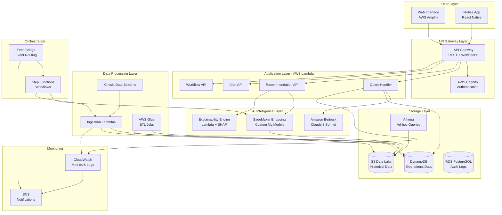

# Technical Design Document: RetailBrain Copilot

## Overview

RetailBrain Copilot is an AI-powered decision assistant system built on AWS that helps retail merchandising, pricing, and inventory teams make faster, data-driven decisions. The system leverages Amazon Bedrock for foundation model access, AWS serverless services for scalability, and a comprehensive suite of AWS managed services to deliver explainable, actionable recommendations through a conversational interface.

### Why AI is Essential

Traditional retail decision-making relies on manual analysis, rigid rule-based systems, and fragmented data sources. This approach leads to:
- **Delayed responses** to market changes (weeks vs. hours)
- **Suboptimal decisions** due to inability to process complex multi-dimensional data
- **Stockouts and overstocking** costing retailers 5-10% of annual revenue
- **Missed revenue opportunities** from poor pricing decisions

AI is essential because:
1. **Pattern Recognition at Scale**: AI models can identify complex demand patterns across thousands of SKUs, locations, and time periods that humans cannot process
2. **Real-time Adaptation**: ML models continuously learn from new data and adapt to changing market conditions
3. **Multi-factor Optimization**: AI can simultaneously optimize across competing objectives (revenue, margin, inventory costs) that are intractable for rule-based systems
4. **Natural Language Understanding**: Foundation models enable non-technical users to interact with complex data through conversational interfaces
5. **Predictive Capabilities**: Time-series forecasting and anomaly detection provide proactive insights that prevent problems before they occur

### AWS Services Justification

**Amazon Bedrock** is used for:
- Natural language understanding and query parsing (Claude/Titan models)
- Generating human-readable explanations of AI decisions
- Conversational interface with context retention
- RAG workflows for retrieving relevant historical patterns

**AWS Lambda** provides:
- Serverless compute for API endpoints (auto-scaling, pay-per-use)
- Event-driven data processing pipelines
- Cost-effective execution of ML inference workloads

**Amazon DynamoDB** offers:
- Single-digit millisecond latency for real-time queries
- Automatic scaling for variable workloads
- Global tables for multi-region deployment

**Amazon S3** serves as:
- Data lake for historical sales, inventory, and pricing data
- Model artifact storage
- Audit log archival

**AWS Step Functions** orchestrates:
- Complex ML workflows (data prep → training → evaluation → deployment)
- Human-in-the-loop approval processes
- Multi-stage recommendation generation

**Amazon SageMaker** enables:
- Custom ML model training for demand forecasting and pricing optimization
- Model hosting with auto-scaling inference endpoints
- Model monitoring and drift detection

### System Architecture





## Architecture

### High-Level Architecture Principles

1. **Serverless-First**: Use Lambda, API Gateway, and managed services to minimize operational overhead
2. **Event-Driven**: Leverage EventBridge and Kinesis for decoupled, scalable data flows
3. **AI-Native**: Amazon Bedrock for NLU/NLG, SageMaker for custom ML models
4. **Security by Design**: Cognito for authentication, IAM for authorization, encryption everywhere
5. **Observable**: CloudWatch for metrics, logs, and traces; X-Ray for distributed tracing

### Component Architecture

#### 1. Data Ingestion Service

**Purpose**: Ingest, validate, and store data from sales, inventory, pricing, and external market sources.

**AWS Services**:
- **Amazon Kinesis Data Streams**: Real-time ingestion of sales transactions and inventory updates
- **AWS Lambda**: Data validation, transformation, and routing functions
- **Amazon S3**: Raw data landing zone and historical data lake
- **AWS Glue**: ETL jobs for batch processing and data quality checks
- **Amazon DynamoDB**: Fast access to current state (latest inventory, active SKUs)
- **Amazon EventBridge**: Event routing for data quality alerts and processing triggers

**Data Flow**:
1. External systems push data to Kinesis Data Streams (sales, inventory, pricing)
2. Lambda consumers validate data in real-time (< 5 seconds per batch)
3. Valid data written to DynamoDB (current state) and S3 (historical archive)
4. Invalid data quarantined in S3 with EventBridge alert to operations team
5. Glue jobs run nightly to aggregate historical data and compute derived metrics

**Validation Logic**:
- Schema validation: Required fields present and correct types
- Range validation: Quantities non-negative, prices within bounds
- Temporal validation: Timestamps within reasonable window (not future, not > 1 year old)
- Referential integrity: SKUs exist in product catalog, locations valid

**Scalability**:
- Kinesis shards auto-scale based on throughput (target: 1M records/hour)
- Lambda concurrency limits set to 100 per function
- DynamoDB on-demand pricing for variable workloads
- S3 lifecycle policies archive data to Glacier after 90 days


#### 2. AI Intelligence Layer

**Purpose**: Generate demand forecasts, pricing recommendations, and risk detections using ML models.

**AWS Services**:
- **Amazon SageMaker**: Training and hosting custom ML models
- **Amazon Bedrock**: Foundation models for NLU, explanation generation, and conversational AI
- **AWS Lambda**: Model inference orchestration and post-processing
- **Amazon S3**: Model artifacts, training data, and feature store
- **Amazon ECR**: Custom container images for SageMaker training jobs

**ML Models**:

**A. Demand Forecaster (SageMaker)**
- **Algorithm**: DeepAR (SageMaker built-in) for probabilistic time-series forecasting
- **Features**: Historical sales (365 days), seasonality indicators, promotion flags, price, day-of-week, holidays
- **Training**: Weekly retraining on latest data using SageMaker Training Jobs
- **Inference**: SageMaker Real-time Endpoint with auto-scaling (1-10 instances)
- **Output**: 30-day forecast with confidence intervals (P10, P50, P90)
- **Target Accuracy**: MAPE < 25% on validation set

**B. Pricing Engine (SageMaker)**
- **Algorithm**: Custom XGBoost model for price elasticity and optimization
- **Features**: Historical price-demand relationship, competitor prices, inventory levels, margin constraints, seasonality
- **Training**: Weekly retraining using SageMaker Training Jobs
- **Inference**: SageMaker Serverless Inference for cost efficiency
- **Output**: Optimal price, discount recommendations, estimated revenue/volume impact
- **Constraints**: Minimum 10% margin, competitive positioning

**C. Risk Detector (SageMaker)**
- **Algorithm**: Isolation Forest for anomaly detection + LSTM for trend change detection
- **Features**: Daily sales, inventory levels, forecast errors, external market indicators
- **Training**: Daily incremental training on rolling 90-day window
- **Inference**: Batch inference via SageMaker Batch Transform (runs hourly)
- **Output**: Anomaly score, severity classification (low/medium/high), affected entities

**D. Natural Language Understanding (Amazon Bedrock)**
- **Model**: Claude 3 Sonnet via Bedrock API
- **Purpose**: Parse user queries, extract intent and entities, generate contextual responses
- **Prompt Engineering**: Few-shot examples for retail domain (SKU queries, forecast requests, alert summaries)
- **Context Management**: Conversation history stored in DynamoDB, passed to Bedrock for multi-turn dialogue
- **RAG Integration**: Vector embeddings of historical patterns stored in OpenSearch, retrieved for context

**E. Explainability Engine (Lambda + SHAP)**
- **Implementation**: Python Lambda function with SHAP library
- **Input**: Model prediction + feature values
- **Processing**: Compute SHAP values to identify top 3 contributing factors
- **Output**: Human-readable explanation with percentage importance scores
- **Bedrock Integration**: Pass SHAP results to Claude for natural language explanation generation


#### 3. Copilot Interface

**Purpose**: Provide conversational natural language interface for users to query data and receive recommendations.

**AWS Services**:
- **AWS Amplify**: Host React web application with CI/CD
- **Amazon API Gateway**: WebSocket API for real-time chat, REST API for queries
- **AWS Lambda**: Query handler, response formatter, session management
- **Amazon Bedrock**: Claude 3 Sonnet for NLU and response generation
- **Amazon DynamoDB**: Session state, conversation history, user preferences
- **Amazon Cognito**: User authentication and authorization

**Query Processing Flow**:
1. User submits natural language query via WebSocket connection
2. API Gateway routes to Query Handler Lambda
3. Lambda retrieves user context (role, permissions, conversation history) from DynamoDB
4. Lambda calls Bedrock with query + context to extract intent and entities
5. Based on intent, Lambda routes to appropriate backend service:
   - Forecast query → SageMaker Demand Forecaster endpoint
   - Pricing query → SageMaker Pricing Engine endpoint
   - Alert query → DynamoDB alerts table
   - SKU performance → DynamoDB + Athena for historical analysis
6. Lambda formats response and calls Bedrock to generate natural language answer
7. Response sent back through WebSocket with < 10 second latency

**Intent Classification**:
- **Forecast Intent**: "What's the demand forecast for SKU X next week?"
- **Pricing Intent**: "What price should I set for SKU Y?"
- **Inventory Intent**: "Which SKUs are at risk of stockout?"
- **Performance Intent**: "Show me slow-moving SKUs in region Z"
- **Explanation Intent**: "Why did you recommend this price?"
- **Simulation Intent**: "What if I increase price by 10%?"

**Role-Based Responses** (Requirement 12):
- User role stored in Cognito user attributes
- Lambda retrieves role and filters data access via IAM policies
- Bedrock prompt includes role context to tailor response emphasis:
  - Merchandiser: Assortment decisions, SKU performance
  - Planner: Demand forecasts, inventory optimization
  - Seller: Pricing recommendations, promotional effectiveness

**Ambiguity Handling**:
- Bedrock identifies missing entities (SKU, time period, location)
- Lambda generates clarifying questions: "Which SKU did you mean: SKU-123 or SKU-456?"
- User response processed in next turn with full context


#### 4. Decision Workflow Engine

**Purpose**: Implement human-in-the-loop approval process for AI recommendations.

**AWS Services**:
- **AWS Step Functions**: Orchestrate approval workflows
- **Amazon DynamoDB**: Store recommendation state and approval history
- **Amazon SNS**: Send approval request notifications
- **Amazon SES**: Email notifications with approval links
- **AWS Lambda**: Workflow triggers, approval handlers, reminder logic
- **Amazon EventBridge**: Schedule reminder checks (every 24 hours)

**Workflow State Machine**:
```
Start → Generate Recommendation → Store in DynamoDB → Send Notification → Wait for Approval
  ↓
Approved → Execute Action → Log Audit Trail → End
  ↓
Rejected → Log Reason → End
  ↓
Modified → Store Modified Version → Execute Modified Action → Log Audit Trail → End
  ↓
Timeout (48 hours) → Send Reminder → Wait for Approval (repeat)
```

**Recommendation Schema** (DynamoDB):
```json
{
  "recommendationId": "rec-uuid",
  "type": "pricing|inventory|clearance",
  "status": "pending|approved|rejected|executed",
  "createdAt": "2024-01-15T10:00:00Z",
  "createdBy": "system",
  "assignedTo": "user-id",
  "originalRecommendation": {
    "sku": "SKU-123",
    "action": "set_price",
    "value": 29.99,
    "confidence": 0.85
  },
  "modifiedRecommendation": null,
  "approvalTimestamp": null,
  "rejectionReason": null,
  "estimatedImpact": {
    "revenue": "+$5000",
    "margin": "+2.5%"
  }
}
```

**Audit Trail** (RDS PostgreSQL):
- Immutable append-only log
- Captures: user, action, timestamp, before/after state, IP address
- Retention: 7 years for compliance
- Indexed on: user_id, timestamp, recommendation_id


#### 5. What-If Simulator

**Purpose**: Allow users to simulate hypothetical scenarios and predict outcomes.

**AWS Services**:
- **AWS Lambda**: Simulation orchestration and scenario management
- **Amazon SageMaker**: Model inference for scenario predictions
- **Amazon DynamoDB**: Store scenario definitions and results
- **Amazon S3**: Cache simulation results for reuse

**Simulation Flow**:
1. User defines scenario via Copilot Interface: "What if I reduce price by 15% for SKU-123?"
2. Lambda extracts scenario parameters: {sku: "SKU-123", price_change: -0.15}
3. Lambda retrieves baseline forecast from DynamoDB
4. Lambda calls SageMaker endpoints with modified features:
   - Demand Forecaster with new price
   - Pricing Engine with new demand
   - Risk Detector with new inventory projection
5. Lambda computes deltas: revenue, margin, inventory impact
6. Results stored in DynamoDB and returned to user
7. User can compare up to 5 scenarios side-by-side

**Scenario Comparison Table**:
| Metric | Baseline | Scenario 1 (-15% price) | Scenario 2 (-10% price) |
|--------|----------|-------------------------|-------------------------|
| Demand | 1000 units | 1250 units (+25%) | 1150 units (+15%) |
| Revenue | $30,000 | $31,875 (+6.3%) | $31,050 (+3.5%) |
| Margin | 25% | 18% (-7pp) | 21% (-4pp) |
| Stockout Risk | Low | Medium | Low |

**Performance Optimization**:
- Cache common scenarios in DynamoDB (TTL 1 hour)
- Batch inference for multiple scenarios in single SageMaker call
- Target latency: < 30 seconds for 5 scenarios


#### 6. Alert and Notification System

**Purpose**: Proactively notify users of stockout risks, overstock situations, and anomalies.

**AWS Services**:
- **Amazon EventBridge**: Event routing and scheduling (daily/hourly checks)
- **AWS Lambda**: Alert generation, severity classification, notification formatting
- **Amazon DynamoDB**: Alert state, user preferences, delivery status
- **Amazon SNS**: Multi-channel notification delivery (email, SMS, mobile push)
- **Amazon SES**: Formatted email with HTML templates
- **Amazon Pinpoint**: Mobile push notifications (optional)

**Alert Types and Triggers**:

**Stockout Risk Alert** (Requirement 9):
- Trigger: EventBridge scheduled rule (daily at 6 AM)
- Lambda queries DynamoDB for current inventory and forecasts
- Calculation: days_of_supply = current_inventory / avg_daily_forecast
- Severity: High (< 3 days), Medium (3-7 days), Low (7-14 days)
- Notification: High → immediate email + push, Medium → email within 1 hour

**Overstock Alert** (Requirement 10):
- Trigger: EventBridge scheduled rule (weekly on Monday)
- Lambda queries DynamoDB for inventory > 60 days of supply
- Calculation: excess_value = (current_inventory - 60*daily_forecast) * unit_cost
- Recommendation: Discount percentage and expected sell-through time
- Notification: Email digest with all overstock SKUs

**Anomaly Alert** (Requirement 8):
- Trigger: EventBridge rule on Risk Detector batch job completion
- Lambda processes anomaly scores from SageMaker output
- Severity: High (score > 0.9), Medium (0.7-0.9), Low (0.5-0.7)
- Notification: High → immediate alert within 5 minutes, Medium → hourly digest

**User Preferences** (DynamoDB):
```json
{
  "userId": "user-123",
  "alertPreferences": {
    "stockoutRisk": {
      "enabled": true,
      "minSeverity": "medium",
      "channels": ["email", "push"]
    },
    "overstock": {
      "enabled": true,
      "minSeverity": "low",
      "channels": ["email"]
    },
    "anomaly": {
      "enabled": true,
      "minSeverity": "high",
      "channels": ["email", "sms"]
    }
  }
}
```

**Notification Deduplication**:
- Alert fingerprint: hash(alert_type, sku, location, date)
- Store in DynamoDB with TTL (24 hours)
- Skip notification if fingerprint exists


## Components and Interfaces

### API Design

**API Gateway Configuration**:
- **REST API**: Synchronous queries, CRUD operations
- **WebSocket API**: Real-time chat interface
- **Authentication**: AWS Cognito authorizer on all endpoints
- **Rate Limiting**: 1000 requests/minute per user
- **CORS**: Enabled for Amplify-hosted frontend

**REST API Endpoints**:

```
POST /api/v1/query
Request:
{
  "query": "What's the demand forecast for SKU-123 next week?",
  "userId": "user-123",
  "sessionId": "session-456"
}
Response:
{
  "answer": "The demand forecast for SKU-123 next week is 1,250 units...",
  "confidence": 0.85,
  "sources": ["demand_forecaster"],
  "visualizations": [{"type": "line_chart", "data": [...]}]
}

GET /api/v1/recommendations
Query Params: ?status=pending&assignedTo=user-123
Response:
{
  "recommendations": [
    {
      "id": "rec-uuid",
      "type": "pricing",
      "sku": "SKU-123",
      "action": "set_price",
      "value": 29.99,
      "confidence": 0.85,
      "estimatedImpact": {...},
      "explanation": "..."
    }
  ],
  "pagination": {"nextToken": "..."}
}

POST /api/v1/recommendations/{id}/approve
Request:
{
  "userId": "user-123",
  "modifications": null
}
Response:
{
  "status": "approved",
  "executionId": "exec-uuid"
}

POST /api/v1/simulate
Request:
{
  "scenarios": [
    {
      "name": "Price Reduction",
      "changes": {"sku": "SKU-123", "price_change": -0.15}
    }
  ]
}
Response:
{
  "results": [
    {
      "scenario": "Price Reduction",
      "metrics": {
        "demand": {"baseline": 1000, "predicted": 1250, "change": "+25%"},
        "revenue": {"baseline": 30000, "predicted": 31875, "change": "+6.3%"}
      }
    }
  ]
}

GET /api/v1/alerts
Query Params: ?severity=high&type=stockout
Response:
{
  "alerts": [
    {
      "id": "alert-uuid",
      "type": "stockout",
      "severity": "high",
      "sku": "SKU-123",
      "location": "Store-456",
      "daysOfSupply": 2.5,
      "recommendedAction": "Replenish 500 units",
      "createdAt": "2024-01-15T10:00:00Z"
    }
  ]
}

GET /api/v1/sku/{skuId}/performance
Response:
{
  "sku": "SKU-123",
  "classification": "high-performing",
  "metrics": {
    "salesVelocity": 15.5,
    "inventoryTurnover": 8.2,
    "marginPercent": 28.5
  },
  "trends": {
    "demand": "increasing",
    "margin": "stable"
  }
}
```

**WebSocket API**:
- Connection: `wss://api.retailbrain.com/chat`
- Authentication: Cognito token in connection request
- Message format: JSON with `action` field
- Actions: `sendMessage`, `getHistory`, `disconnect`


### Lambda Function Interfaces

**Query Handler Lambda**:
```python
def lambda_handler(event, context):
    """
    Process natural language queries and generate responses.
    
    Input: API Gateway event with query, userId, sessionId
    Output: Natural language response with confidence and sources
    
    Dependencies:
    - Bedrock client for NLU
    - DynamoDB for session state
    - SageMaker runtime for model inference
    """
    query = event['body']['query']
    user_id = event['body']['userId']
    session_id = event['body']['sessionId']
    
    # Retrieve conversation history and user context
    context = get_user_context(user_id, session_id)
    
    # Call Bedrock to extract intent and entities
    intent_result = bedrock_extract_intent(query, context)
    
    # Route to appropriate backend service
    if intent_result['intent'] == 'forecast':
        data = get_forecast(intent_result['entities'])
    elif intent_result['intent'] == 'pricing':
        data = get_pricing_recommendation(intent_result['entities'])
    
    # Generate natural language response
    response = bedrock_generate_response(query, data, context)
    
    # Store in conversation history
    save_conversation_turn(session_id, query, response)
    
    return {
        'statusCode': 200,
        'body': json.dumps(response)
    }
```

**Data Ingestion Lambda**:
```python
def lambda_handler(event, context):
    """
    Validate and process incoming data from Kinesis.
    
    Input: Kinesis event with batch of records
    Output: Success/failure status
    
    Side effects:
    - Write valid data to DynamoDB and S3
    - Quarantine invalid data
    - Emit EventBridge events for alerts
    """
    records = event['Records']
    valid_records = []
    invalid_records = []
    
    for record in records:
        data = json.loads(base64.b64decode(record['kinesis']['data']))
        
        if validate_schema(data) and validate_ranges(data):
            valid_records.append(data)
        else:
            invalid_records.append({
                'data': data,
                'errors': get_validation_errors(data)
            })
    
    # Write valid data
    batch_write_dynamodb(valid_records)
    write_to_s3(valid_records, 'valid/')
    
    # Quarantine invalid data
    if invalid_records:
        write_to_s3(invalid_records, 'quarantine/')
        emit_data_quality_alert(invalid_records)
    
    return {
        'statusCode': 200,
        'processedCount': len(valid_records),
        'invalidCount': len(invalid_records)
    }
```

**Explainability Lambda**:
```python
def lambda_handler(event, context):
    """
    Generate explanations for model predictions using SHAP.
    
    Input: Model prediction, feature values, model type
    Output: Human-readable explanation with top factors
    
    Dependencies:
    - SHAP library for feature importance
    - Bedrock for natural language generation
    - S3 for model artifacts
    """
    prediction = event['prediction']
    features = event['features']
    model_type = event['modelType']
    
    # Load model from S3
    model = load_model_from_s3(model_type)
    
    # Compute SHAP values
    explainer = shap.TreeExplainer(model)
    shap_values = explainer.shap_values(features)
    
    # Identify top 3 factors
    top_factors = get_top_factors(shap_values, features, n=3)
    
    # Generate natural language explanation
    explanation = bedrock_generate_explanation(
        prediction, top_factors, model_type
    )
    
    return {
        'statusCode': 200,
        'body': json.dumps({
            'explanation': explanation,
            'topFactors': top_factors,
            'confidence': calculate_confidence(shap_values)
        })
    }
```


## Data Models

### DynamoDB Tables

**Table: SKU_Inventory**
- **Partition Key**: `sku` (String)
- **Sort Key**: `location` (String)
- **Attributes**:
  - `quantityOnHand` (Number)
  - `lastUpdated` (String, ISO timestamp)
  - `daysOfSupply` (Number, computed)
  - `stockoutRisk` (String: "low"|"medium"|"high")
- **GSI**: `StockoutRiskIndex` on `stockoutRisk` + `daysOfSupply`
- **Capacity**: On-demand
- **TTL**: None (current state)

**Table: Forecasts**
- **Partition Key**: `sku` (String)
- **Sort Key**: `date` (String, YYYY-MM-DD)
- **Attributes**:
  - `location` (String)
  - `forecastedDemand` (Number)
  - `confidenceInterval` (Map: {p10, p50, p90})
  - `generatedAt` (String, ISO timestamp)
  - `modelVersion` (String)
- **GSI**: `LocationDateIndex` on `location` + `date`
- **Capacity**: On-demand
- **TTL**: `expiresAt` (90 days)

**Table: Recommendations**
- **Partition Key**: `recommendationId` (String, UUID)
- **Sort Key**: `createdAt` (String, ISO timestamp)
- **Attributes**:
  - `type` (String: "pricing"|"inventory"|"clearance")
  - `status` (String: "pending"|"approved"|"rejected"|"executed")
  - `assignedTo` (String, user ID)
  - `sku` (String)
  - `originalRecommendation` (Map)
  - `modifiedRecommendation` (Map, nullable)
  - `confidence` (Number, 0-1)
  - `estimatedImpact` (Map: {revenue, margin, inventory})
  - `explanation` (String)
  - `approvalTimestamp` (String, nullable)
  - `rejectionReason` (String, nullable)
- **GSI**: `UserStatusIndex` on `assignedTo` + `status`
- **GSI**: `SKUIndex` on `sku` + `createdAt`
- **Capacity**: On-demand

**Table: Alerts**
- **Partition Key**: `alertId` (String, UUID)
- **Sort Key**: `createdAt` (String, ISO timestamp)
- **Attributes**:
  - `type` (String: "stockout"|"overstock"|"anomaly")
  - `severity` (String: "low"|"medium"|"high")
  - `sku` (String)
  - `location` (String)
  - `description` (String)
  - `recommendedAction` (String)
  - `status` (String: "active"|"acknowledged"|"resolved")
  - `acknowledgedBy` (String, nullable)
  - `fingerprint` (String, for deduplication)
- **GSI**: `SeverityTypeIndex` on `severity` + `type`
- **GSI**: `SKULocationIndex` on `sku` + `location`
- **Capacity**: On-demand
- **TTL**: `expiresAt` (30 days)

**Table: ConversationHistory**
- **Partition Key**: `sessionId` (String, UUID)
- **Sort Key**: `timestamp` (String, ISO timestamp)
- **Attributes**:
  - `userId` (String)
  - `userMessage` (String)
  - `assistantResponse` (String)
  - `intent` (String)
  - `entities` (Map)
  - `sources` (List of Strings)
- **GSI**: `UserIndex` on `userId` + `timestamp`
- **Capacity**: On-demand
- **TTL**: `expiresAt` (90 days)

**Table: UserPreferences**
- **Partition Key**: `userId` (String)
- **Attributes**:
  - `role` (String: "merchandiser"|"planner"|"seller")
  - `alertPreferences` (Map)
  - `dashboardConfig` (Map)
  - `notificationChannels` (List)
- **Capacity**: Provisioned (low, 5 RCU/WCU)


### S3 Data Lake Structure

```
s3://retailbrain-data-lake/
├── raw/
│   ├── sales/
│   │   └── year=2024/month=01/day=15/
│   │       └── sales_20240115_*.json
│   ├── inventory/
│   │   └── year=2024/month=01/day=15/
│   │       └── inventory_20240115_*.json
│   ├── pricing/
│   │   └── year=2024/month=01/day=15/
│   │       └── pricing_20240115_*.json
│   └── external/
│       └── competitor_prices_20240115.json
├── processed/
│   ├── aggregated_sales/
│   │   └── year=2024/month=01/
│   │       └── daily_sales_by_sku.parquet
│   ├── features/
│   │   └── demand_forecast_features_20240115.parquet
│   └── model_outputs/
│       ├── forecasts_20240115.parquet
│       └── anomalies_20240115.parquet
├── quarantine/
│   └── invalid_data_20240115.json
├── models/
│   ├── demand_forecaster/
│   │   └── v1.2.3/
│   │       ├── model.tar.gz
│   │       └── metadata.json
│   ├── pricing_engine/
│   │   └── v2.0.1/
│   │       ├── model.tar.gz
│   │       └── metadata.json
│   └── risk_detector/
│       └── v1.5.0/
│           ├── model.tar.gz
│           └── metadata.json
└── audit_logs/
    └── year=2024/month=01/day=15/
        └── audit_20240115.json.gz
```

**Lifecycle Policies**:
- Raw data: Transition to S3 Glacier after 90 days
- Processed data: Transition to Glacier after 180 days
- Quarantine: Delete after 30 days
- Models: Keep latest 5 versions, archive older to Glacier
- Audit logs: Transition to Glacier after 1 year, retain for 7 years

### RDS PostgreSQL Schema (Audit Logs)

**Table: audit_trail**
```sql
CREATE TABLE audit_trail (
    id BIGSERIAL PRIMARY KEY,
    event_timestamp TIMESTAMP NOT NULL DEFAULT NOW(),
    user_id VARCHAR(255) NOT NULL,
    user_role VARCHAR(50),
    event_type VARCHAR(100) NOT NULL,
    resource_type VARCHAR(100),
    resource_id VARCHAR(255),
    action VARCHAR(50) NOT NULL,
    before_state JSONB,
    after_state JSONB,
    ip_address INET,
    user_agent TEXT,
    session_id VARCHAR(255),
    success BOOLEAN NOT NULL,
    error_message TEXT
);

CREATE INDEX idx_audit_user_timestamp ON audit_trail(user_id, event_timestamp DESC);
CREATE INDEX idx_audit_resource ON audit_trail(resource_type, resource_id);
CREATE INDEX idx_audit_timestamp ON audit_trail(event_timestamp DESC);
CREATE INDEX idx_audit_event_type ON audit_trail(event_type);
```

**Table: model_performance**
```sql
CREATE TABLE model_performance (
    id BIGSERIAL PRIMARY KEY,
    model_name VARCHAR(100) NOT NULL,
    model_version VARCHAR(50) NOT NULL,
    evaluation_date DATE NOT NULL,
    metric_name VARCHAR(100) NOT NULL,
    metric_value NUMERIC(10, 4) NOT NULL,
    dataset_size INTEGER,
    metadata JSONB
);

CREATE INDEX idx_model_perf_name_date ON model_performance(model_name, evaluation_date DESC);
CREATE UNIQUE INDEX idx_model_perf_unique ON model_performance(model_name, model_version, evaluation_date, metric_name);
```


## Correctness Properties

*A property is a characteristic or behavior that should hold true across all valid executions of a system—essentially, a formal statement about what the system should do. Properties serve as the bridge between human-readable specifications and machine-verifiable correctness guarantees.*

### Property Reflection

After analyzing all 25 requirements and their acceptance criteria, I identified the following redundancies and consolidation opportunities:

**Redundancy Analysis**:
1. **Data Ingestion Properties (1.1, 2.1, 3.1, 3.2, 4.1, 4.2)**: All test field presence for different data types. These can be consolidated into a single property about schema validation.

2. **Validation Performance (1.2, 1.4, 2.3)**: Multiple properties test that operations complete within time bounds. These can be consolidated into properties about validation and storage performance.

3. **Calculation Formulas (7.2, 7.3, 9.2, 10.2, 10.3, 14.6)**: Multiple properties test specific calculation formulas. Each is unique and should be kept separate.

4. **Output Field Presence (5.6, 6.5, 13.2, 13.3, 13.4, 14.1-14.3)**: Many properties test that outputs include required fields. These can be grouped by output type (forecasts, recommendations, explanations).

5. **Alert Generation (9.1, 10.1, 8.5, 22.1-22.3)**: Multiple properties test alert generation under different conditions. Each has unique logic and should be kept separate.

6. **Audit Logging (15.7, 20.5, 24.1-24.3)**: Multiple properties test logging of different event types. These can be consolidated into a comprehensive audit logging property.

**Consolidated Properties**:
After reflection, I will consolidate similar properties while ensuring each remaining property provides unique validation value. The final property set focuses on:
- Data ingestion and validation (consolidated by data type)
- ML model outputs and accuracy
- Business logic calculations
- Alert and notification logic
- Security and access control
- Audit and compliance

### Core System Properties


### Property 1: Data Ingestion Schema Validation

*For any* data record (sales, inventory, pricing, or external market data), when ingested by the Data_Ingestion_Service, the system should validate that all required fields for that data type are present and non-null, and either accept the record (storing it in DynamoDB and S3) or reject it (quarantining it in S3 with an error log).

**Validates: Requirements 1.1, 1.3, 2.1, 3.1, 3.2, 4.1, 4.2, 23.1**

### Property 2: Numerical Validation Constraints

*For any* data record with numerical fields (quantities, prices, percentages), the Data_Ingestion_Service should validate that quantities are non-negative, promotional prices do not exceed base prices, and all numerical values are within expected ranges, rejecting invalid records.

**Validates: Requirements 2.2, 3.3, 23.2**

### Property 3: Temporal Validation

*For any* data record with timestamps, the Data_Ingestion_Service should validate that timestamps are in ISO 8601 format, not in the future, and within a reasonable historical window (not older than 2 years for transactional data, within 24 hours for external data), rejecting records that fail validation.

**Validates: Requirements 4.3, 23.3**

### Property 4: Data Quarantine Isolation

*For any* invalid data record that fails validation, the Data_Ingestion_Service should quarantine it in a separate S3 location and prevent it from being used in any ML model training or inference, ensuring data quality issues do not corrupt forecasts.

**Validates: Requirements 23.4**

### Property 5: Inventory History Preservation

*For any* SKU and location combination, when inventory updates are ingested over time, the system should maintain a complete history of all inventory level changes with timestamps, allowing reconstruction of inventory state at any point in time.

**Validates: Requirements 2.4**

### Property 6: Pricing-Sales Data Linkage

*For any* pricing record and sales record with matching SKU and overlapping time periods, the system should correctly link them such that sales data can be queried with the corresponding active price at the time of sale.

**Validates: Requirements 3.4**

### Property 7: External Data Resilience

*For any* batch processing job that depends on both internal and external data sources, if external data is missing or unavailable, the system should continue processing internal data without failure or blocking.

**Validates: Requirements 4.4**

### Property 8: Forecast Aggregation Consistency

*For any* set of store-level demand forecasts within a region, the region-level forecast should equal the sum of all store-level forecasts for the same SKU and time period, ensuring aggregation consistency.

**Validates: Requirements 5.2**

### Property 9: Forecast Output Completeness

*For any* demand forecast generated by the Demand_Forecaster, the output should include a 30-day prediction, confidence intervals (P10, P50, P90), a confidence score between 0 and 1, and metadata about the model version and generation timestamp.

**Validates: Requirements 5.1, 5.6**

### Property 10: Pricing Margin Constraint

*For any* pricing recommendation generated by the Pricing_Engine, the recommended price should maintain at least a 10% gross margin when compared to the product's cost, ensuring profitability constraints are never violated.

**Validates: Requirements 6.3**

### Property 11: Recommendation Output Completeness

*For any* recommendation (pricing, inventory, or clearance) generated by the system, the output should include the recommended action, a confidence score between 0 and 1, estimated impacts on revenue/margin/inventory, and a human-readable explanation with top 3 contributing factors.

**Validates: Requirements 6.4, 6.5, 13.1, 13.2, 13.3, 13.4, 14.1, 14.2, 14.3**

### Property 12: Low Confidence Warning

*For any* recommendation with a confidence score below 0.7, the Explainability_Engine should include a caution statement in the explanation warning users about the uncertainty.

**Validates: Requirements 13.5**

### Property 13: Impact Estimate Format

*For any* recommendation's impact estimate, the system should express impacts as both absolute values (e.g., "$5,000") and percentage changes from baseline (e.g., "+6.3%"), and provide best case, expected case, and worst case scenarios.

**Validates: Requirements 14.4, 14.5**

### Property 14: Expected Value Calculation

*For any* recommendation with multiple scenario outcomes, the system should calculate the expected value as the probability-weighted average of all scenarios, where probabilities sum to 1.0.

**Validates: Requirements 14.6**

### Property 15: Sales Velocity Calculation

*For any* SKU, the system should calculate sales velocity as the total units sold divided by the number of days in the measurement period (90 days), using actual sales data from DynamoDB.

**Validates: Requirements 7.2**

### Property 16: Inventory Turnover Calculation

*For any* SKU, the system should calculate inventory turnover as the ratio of total units sold to the average inventory level over the past 90 days, where average inventory is computed as the mean of daily inventory snapshots.

**Validates: Requirements 7.3**

### Property 17: SKU Classification Logic

*For any* SKU with computed sales velocity and inventory turnover metrics, the system should classify it as high-performing (velocity > 10 units/day AND turnover > 6), slow-moving (velocity < 3 units/day OR turnover < 2), or average-performing (all others).

**Validates: Requirements 7.1**

### Property 18: Clearance Recommendation Trigger

*For any* SKU that has been classified as slow-moving for 30 consecutive days, the system should generate a clearance recommendation with a suggested discount percentage and expected sell-through time.

**Validates: Requirements 7.4**

### Property 19: Sales Anomaly Detection

*For any* SKU on any day, if actual sales deviate by more than 3 standard deviations from the forecasted value, the Risk_Detector should identify it as a sales anomaly and classify its severity based on the magnitude of deviation.

**Validates: Requirements 8.1**

### Property 20: Trend Change Detection

*For any* SKU, if week-over-week demand changes by more than 50% (either growth or decline), the Risk_Detector should identify it as a sudden trend change and generate an alert.

**Validates: Requirements 8.3**

### Property 21: Anomaly Output Completeness

*For any* detected anomaly, the Risk_Detector should provide a description including affected SKUs, locations, time period, severity classification (low/medium/high), and an anomaly score.

**Validates: Requirements 8.4, 8.6**

### Property 22: Days of Supply Calculation

*For any* SKU and location, the system should calculate days of supply as current inventory quantity divided by average daily forecasted demand for the next 7 days.

**Validates: Requirements 9.2**

### Property 23: Stockout Risk Classification

*For any* SKU and location, the system should classify stockout risk as high when days of supply < 3, medium when days of supply is between 3 and 7, and low when days of supply > 7.

**Validates: Requirements 9.3, 9.4**

### Property 24: Stockout Alert Generation

*For any* SKU and location where forecasted demand exceeds current inventory within the next 7 days, the system should generate a stockout risk alert including the estimated stockout date and recommended replenishment quantity.

**Validates: Requirements 9.1, 9.5**

### Property 25: Overstock Alert Generation

*For any* SKU and location where current inventory exceeds 60 days of forecasted demand, the system should generate an overstock alert including excess inventory value, estimated carrying costs (2% monthly rate), and clearance recommendations.

**Validates: Requirements 10.1, 10.2, 10.3, 10.4**

### Property 26: Query Intent Extraction

*For any* natural language query submitted to the Copilot_Interface, the system should parse it using Bedrock to extract the intent (forecast/pricing/inventory/performance/explanation/simulation), entities (SKU, location, time period), and any missing required parameters.

**Validates: Requirements 11.2**

### Property 27: Ambiguity Handling

*For any* query where required entities are missing or ambiguous (e.g., multiple SKUs match a partial name), the Copilot_Interface should generate clarifying questions before attempting to answer the query.

**Validates: Requirements 11.3**

### Property 28: Query Type Support

*For any* query with intent matching one of the supported types (demand forecasts, pricing recommendations, inventory status, SKU performance, explanations, simulations), the Copilot_Interface should route it to the appropriate backend service and generate a response.

**Validates: Requirements 11.5**

### Property 29: Missing Data Explanation

*For any* query that cannot be answered due to missing data, the Copilot_Interface should explain specifically what data is missing and suggest alternative queries that can be answered with available data.

**Validates: Requirements 11.6**

### Property 30: Role-Based Response Tailoring

*For any* user query, the Copilot_Interface should retrieve the user's role (merchandiser/planner/seller) from Cognito and tailor the response emphasis accordingly: merchandisers receive assortment insights, planners receive demand/inventory insights, sellers receive pricing insights.

**Validates: Requirements 12.2, 12.3, 12.4**

### Property 31: Role-Based Data Access Control

*For any* user attempting to access data, the system should enforce role-based access control such that users can only access data permitted by their role, blocking unauthorized access attempts and logging them.

**Validates: Requirements 12.5, 20.2**

### Property 32: Recommendation Approval Requirement

*For any* AI-generated recommendation, the Decision_Workflow should require explicit user approval (approve/reject/modify) before the recommendation is executed, preventing automatic execution without human oversight.

**Validates: Requirements 15.1, 15.2**

### Property 33: Modification Tracking

*For any* recommendation that a user modifies before approval, the Decision_Workflow should store both the original AI-generated recommendation and the user-modified version in DynamoDB, maintaining a complete history.

**Validates: Requirements 15.3**

### Property 34: Rejection Reason Requirement

*For any* recommendation that a user rejects, the Decision_Workflow should prompt for and require a rejection reason before completing the rejection action.

**Validates: Requirements 15.4**

### Property 35: Recommendation Status Tracking

*For any* recommendation throughout its lifecycle, the system should track its status as one of: pending, approved, rejected, or executed, with timestamps for each status transition.

**Validates: Requirements 15.5**

### Property 36: Approval Reminder Logic

*For any* recommendation that remains in pending status for more than 48 hours, the Decision_Workflow should send a reminder notification to the assigned user via their configured notification channels.

**Validates: Requirements 15.6**

### Property 37: Scenario Simulation Output

*For any* what-if scenario defined by a user (with adjustments to pricing, inventory, or promotions), the What_If_Simulator should generate forecasts for demand, revenue, and margin under that scenario, and compare them to the baseline forecast.

**Validates: Requirements 16.1, 16.2, 16.3**

### Property 38: Multi-Scenario Support

*For any* simulation request, the What_If_Simulator should support up to 5 concurrent scenarios, allowing users to compare multiple alternatives side-by-side.

**Validates: Requirements 16.4**

### Property 39: Cross-Functional Data Integration

*For any* pricing recommendation, the Pricing_Engine should consider current inventory levels and demand forecasts; for any demand forecast, the Demand_Forecaster should consider planned promotions and pricing changes; ensuring cross-functional intelligence integration.

**Validates: Requirements 17.1, 17.2, 17.3**

### Property 40: Recommendation Conflict Detection

*For any* pair of recommendations from different subsystems (e.g., pricing vs. inventory) that affect the same SKU, the system should detect if they conflict (e.g., one recommends price increase while another recommends clearance) and present both to the user with explanations.

**Validates: Requirements 17.4, 17.5**

### Property 41: Authentication Enforcement

*For any* request to the Copilot_Interface or API endpoints, the system should authenticate the user via AWS Cognito before granting access, rejecting unauthenticated requests with a 401 status code.

**Validates: Requirements 20.1**

### Property 42: Comprehensive Audit Logging

*For any* user action (query, approval, rejection, configuration change), AI-generated recommendation, or data access event, the system should log it to RDS PostgreSQL with user ID, timestamp, action type, resource ID, and before/after state, ensuring immutable audit trails.

**Validates: Requirements 15.7, 20.5, 24.1, 24.2, 24.3**

### Property 43: Unauthorized Access Response

*For any* unauthorized access attempt detected by the system, it should block the request, log the attempt with full details, and send an alert to the security team within 1 minute via SNS.

**Validates: Requirements 20.6**

### Property 44: Model Performance Tracking

*For any* ML model (Demand_Forecaster, Pricing_Engine, Risk_Detector), the system should track accuracy metrics (MAPE, RMSE, bias) by comparing predictions to actual outcomes daily, storing results in RDS for at least 12 months.

**Validates: Requirements 21.1, 21.2, 21.5**

### Property 45: Model Degradation Alerting

*For any* ML model, if forecast accuracy (MAPE) degrades by more than 10% from the baseline over a 7-day rolling window, the system should generate a model performance alert to the data science team.

**Validates: Requirements 21.3**

### Property 46: Alert Notification Delivery

*For any* high-severity alert, the system should deliver it via email within 5 minutes and via push notification (if enabled); for medium-severity alerts, deliver via email within 1 hour; for low-severity alerts, aggregate into a daily digest email.

**Validates: Requirements 22.1, 22.2, 22.3, 22.4**

### Property 47: Alert Notification Content

*For any* alert notification sent to a user, it should include a description of the issue, severity level, affected entities (SKU, location), recommended action, and a direct link to view full details in the Copilot Interface.

**Validates: Requirements 22.6**

### Property 48: User Alert Preferences

*For any* user, the system should allow them to configure alert preferences (enabled/disabled per alert type, minimum severity threshold, notification channels) and respect these preferences when delivering alerts.

**Validates: Requirements 22.5**

### Property 49: Data Quality Reporting

*For any* 24-hour period, the Data_Ingestion_Service should generate a data quality report including validation failure counts by data source and error type, and if quality falls below 95% for any source, alert the data operations team.

**Validates: Requirements 23.5, 23.6**

### Property 50: System Health Monitoring

*For any* system component (Lambda, SageMaker, DynamoDB, API Gateway), the system should monitor resource utilization (CPU, memory, disk), API response times, error rates, and database performance, logging metrics to CloudWatch.

**Validates: Requirements 25.1, 25.2, 25.3**

### Property 51: Health Threshold Alerting

*For any* health metric, when it exceeds a warning threshold, the system should log a warning event to CloudWatch; when it exceeds a critical threshold, the system should alert the operations team within 2 minutes via SNS.

**Validates: Requirements 25.4, 25.5**


## Error Handling

### Error Categories

**1. Data Validation Errors**
- **Cause**: Invalid data format, missing fields, out-of-range values
- **Handling**: 
  - Quarantine invalid records in S3 `quarantine/` prefix
  - Log detailed validation errors with record ID and error type
  - Emit EventBridge event to trigger data quality alert
  - Return 400 Bad Request to API clients with specific error message
- **Recovery**: Data operations team reviews quarantined data, corrects source system issues

**2. ML Model Errors**
- **Cause**: Model inference timeout, invalid input features, model endpoint unavailable
- **Handling**:
  - Retry with exponential backoff (3 attempts, 1s, 2s, 4s delays)
  - Fall back to previous forecast/recommendation if available
  - Log error to CloudWatch with model name, version, and input features
  - Return 503 Service Unavailable to API clients
  - Alert ML ops team if error rate exceeds 5% over 15 minutes
- **Recovery**: ML ops team investigates model endpoint health, rolls back to previous version if needed

**3. External Data Unavailability**
- **Cause**: Competitor pricing API down, market data feed delayed
- **Handling**:
  - Continue processing with internal data only
  - Log warning that external data is missing
  - Include disclaimer in recommendations: "Based on internal data only; external market data unavailable"
  - Retry external data fetch every 30 minutes
- **Recovery**: Automatic when external source recovers

**4. Authentication/Authorization Errors**
- **Cause**: Invalid Cognito token, expired session, insufficient permissions
- **Handling**:
  - Return 401 Unauthorized for authentication failures
  - Return 403 Forbidden for authorization failures
  - Log access attempt with user ID, IP address, requested resource
  - Alert security team if > 10 failed attempts from same IP in 5 minutes
- **Recovery**: User re-authenticates or requests permission elevation

**5. Database Errors**
- **Cause**: DynamoDB throttling, RDS connection pool exhausted, query timeout
- **Handling**:
  - Implement exponential backoff for throttled requests
  - Use DynamoDB on-demand capacity to auto-scale
  - Set Lambda reserved concurrency to prevent connection pool exhaustion
  - Cache frequently accessed data in Lambda memory (5-minute TTL)
  - Return 503 Service Unavailable to clients
- **Recovery**: Auto-scaling resolves capacity issues; operations team investigates persistent problems

**6. Bedrock API Errors**
- **Cause**: Rate limiting, model unavailable, malformed prompt
- **Handling**:
  - Implement token bucket rate limiting (100 requests/minute per user)
  - Retry with exponential backoff for transient errors
  - Fall back to template-based responses for simple queries
  - Log error with prompt (sanitized of PII) and error code
  - Return 503 Service Unavailable or 429 Too Many Requests
- **Recovery**: Automatic retry resolves transient issues; adjust rate limits if persistent

**7. Workflow Timeout Errors**
- **Cause**: Step Functions workflow exceeds maximum duration, user doesn't respond to approval
- **Handling**:
  - Set workflow timeout to 7 days for approval workflows
  - Send reminder notifications at 48 hours, 96 hours, 144 hours
  - Auto-expire recommendations after 7 days with status "expired"
  - Log timeout event with workflow ID and last state
- **Recovery**: User can request regeneration of expired recommendation

### Error Response Format

All API errors return consistent JSON structure:

```json
{
  "error": {
    "code": "VALIDATION_ERROR",
    "message": "Sales data missing required field: sku",
    "details": {
      "field": "sku",
      "recordId": "rec-12345"
    },
    "requestId": "req-uuid",
    "timestamp": "2024-01-15T10:30:00Z"
  }
}
```

### Circuit Breaker Pattern

For external dependencies (SageMaker endpoints, Bedrock API):
- **Closed State**: Normal operation, all requests pass through
- **Open State**: After 5 consecutive failures, stop sending requests for 60 seconds
- **Half-Open State**: After 60 seconds, allow 1 test request; if successful, close circuit; if failed, reopen for 60 seconds

Implementation: AWS Lambda Powertools circuit breaker decorator


## Testing Strategy

### Dual Testing Approach

The RetailBrain Copilot system requires both unit testing and property-based testing for comprehensive coverage:

**Unit Tests**: Verify specific examples, edge cases, and error conditions
- Specific input/output examples that demonstrate correct behavior
- Integration points between components (Lambda → DynamoDB, Lambda → Bedrock)
- Edge cases (empty data, boundary values, null handling)
- Error conditions (invalid input, service unavailable, timeout)

**Property-Based Tests**: Verify universal properties across all inputs
- Universal properties that hold for all valid inputs
- Comprehensive input coverage through randomization
- Catch unexpected edge cases that manual test cases miss

Together, these approaches provide comprehensive coverage: unit tests catch concrete bugs in specific scenarios, while property tests verify general correctness across the input space.

### Property-Based Testing Configuration

**Framework Selection**:
- **Python**: Hypothesis library for Lambda functions and SageMaker training scripts
- **TypeScript**: fast-check library for frontend React components
- **Test Configuration**: Minimum 100 iterations per property test (due to randomization)

**Property Test Tagging**:
Each property-based test must include a comment tag referencing the design document property:

```python
# Feature: retail-brain-copilot, Property 1: Data Ingestion Schema Validation
@given(st.data_records())
def test_data_ingestion_schema_validation(record):
    result = ingest_data(record)
    if has_required_fields(record):
        assert result.status == "accepted"
        assert record_exists_in_dynamodb(record.id)
    else:
        assert result.status == "rejected"
        assert record_exists_in_quarantine(record.id)
```

### Test Coverage by Component

**Data Ingestion Service**:
- Unit Tests:
  - Valid sales record ingestion → stored in DynamoDB
  - Invalid record (missing SKU) → quarantined in S3
  - Negative quantity → rejected with error
  - Promotional price > base price → rejected
  - Timestamp in future → rejected
- Property Tests:
  - Property 1: Schema validation for all data types
  - Property 2: Numerical validation constraints
  - Property 3: Temporal validation
  - Property 4: Data quarantine isolation
  - Property 5: Inventory history preservation
  - Property 6: Pricing-sales data linkage
  - Property 7: External data resilience

**Demand Forecaster**:
- Unit Tests:
  - Forecast for single SKU → returns 30-day prediction
  - Forecast with promotion flag → higher demand than baseline
  - Forecast with seasonality → peaks in expected periods
  - Invalid SKU → returns error
- Property Tests:
  - Property 8: Forecast aggregation consistency
  - Property 9: Forecast output completeness

**Pricing Engine**:
- Unit Tests:
  - Pricing recommendation for high-margin SKU → maintains margin
  - Pricing recommendation with competitor data → competitive positioning
  - Slow-moving SKU → discount recommendation
  - Cost = $90, price = $100 → margin = 10% (boundary case)
- Property Tests:
  - Property 10: Pricing margin constraint
  - Property 11: Recommendation output completeness

**Explainability Engine**:
- Unit Tests:
  - High confidence prediction (0.9) → no caution statement
  - Low confidence prediction (0.6) → includes caution statement
  - SHAP values computed → top 3 factors identified
- Property Tests:
  - Property 11: Recommendation output completeness
  - Property 12: Low confidence warning
  - Property 13: Impact estimate format
  - Property 14: Expected value calculation

**SKU Performance Classification**:
- Unit Tests:
  - Sales velocity = 15, turnover = 8 → high-performing
  - Sales velocity = 2, turnover = 1.5 → slow-moving
  - Slow-moving for 30 days → clearance recommendation
- Property Tests:
  - Property 15: Sales velocity calculation
  - Property 16: Inventory turnover calculation
  - Property 17: SKU classification logic
  - Property 18: Clearance recommendation trigger

**Risk Detector**:
- Unit Tests:
  - Sales = 1000, forecast = 500, stddev = 100 → anomaly detected (5σ)
  - Week-over-week change = 60% → trend change detected
  - Anomaly score = 0.95 → high severity
- Property Tests:
  - Property 19: Sales anomaly detection
  - Property 20: Trend change detection
  - Property 21: Anomaly output completeness

**Alert System**:
- Unit Tests:
  - Days of supply = 2 → high stockout risk alert
  - Inventory = 100, forecast = 1/day → 100 days supply → overstock alert
  - High severity alert → email sent within 5 minutes
- Property Tests:
  - Property 22: Days of supply calculation
  - Property 23: Stockout risk classification
  - Property 24: Stockout alert generation
  - Property 25: Overstock alert generation
  - Property 46: Alert notification delivery
  - Property 47: Alert notification content
  - Property 48: User alert preferences

**Copilot Interface**:
- Unit Tests:
  - Query: "What's the forecast for SKU-123?" → forecast response
  - Query: "What's the forecast?" (missing SKU) → clarifying question
  - Query about unavailable data → explanation of missing data
  - Merchandiser query → response emphasizes assortment insights
- Property Tests:
  - Property 26: Query intent extraction
  - Property 27: Ambiguity handling
  - Property 28: Query type support
  - Property 29: Missing data explanation
  - Property 30: Role-based response tailoring
  - Property 31: Role-based data access control

**Decision Workflow**:
- Unit Tests:
  - Recommendation created → status = pending
  - User approves → status = approved, execution triggered
  - User rejects without reason → prompted for reason
  - Pending for 48 hours → reminder sent
- Property Tests:
  - Property 32: Recommendation approval requirement
  - Property 33: Modification tracking
  - Property 34: Rejection reason requirement
  - Property 35: Recommendation status tracking
  - Property 36: Approval reminder logic

**What-If Simulator**:
- Unit Tests:
  - Scenario: price -15% → demand +25%, revenue +6.3%
  - 5 scenarios defined → all 5 results returned
  - Scenario results → include baseline comparison
- Property Tests:
  - Property 37: Scenario simulation output
  - Property 38: Multi-scenario support

**Cross-Functional Integration**:
- Unit Tests:
  - Pricing recommendation → considers current inventory
  - Demand forecast → considers planned promotions
  - Conflicting recommendations → both presented to user
- Property Tests:
  - Property 39: Cross-functional data integration
  - Property 40: Recommendation conflict detection

**Security and Compliance**:
- Unit Tests:
  - Request without Cognito token → 401 Unauthorized
  - Planner accessing seller-only data → 403 Forbidden
  - User action → logged to audit trail
  - 10 failed login attempts → security alert
- Property Tests:
  - Property 41: Authentication enforcement
  - Property 42: Comprehensive audit logging
  - Property 43: Unauthorized access response

**Model Monitoring**:
- Unit Tests:
  - Forecast vs actual → MAPE calculated
  - MAPE increases 15% → model degradation alert
  - Performance metrics → stored for 12 months
- Property Tests:
  - Property 44: Model performance tracking
  - Property 45: Model degradation alerting

**Data Quality**:
- Unit Tests:
  - 1000 records, 50 invalid → 95% quality, no alert
  - 1000 records, 60 invalid → 94% quality, alert sent
  - Daily report → includes failure counts by source
- Property Tests:
  - Property 49: Data quality reporting

**System Health**:
- Unit Tests:
  - CPU > 80% → warning logged
  - CPU > 95% → critical alert sent within 2 minutes
  - Health metrics → retained for 90 days
- Property Tests:
  - Property 50: System health monitoring
  - Property 51: Health threshold alerting

### Integration Testing

**End-to-End Scenarios**:
1. **Data Ingestion → Forecast → Alert Flow**:
   - Ingest sales data for SKU-123
   - Trigger daily forecast job
   - Verify forecast generated
   - Simulate low inventory
   - Verify stockout alert generated and delivered

2. **Query → Recommendation → Approval Flow**:
   - User queries: "What price should I set for SKU-456?"
   - Verify Bedrock extracts intent and entities
   - Verify SageMaker generates pricing recommendation
   - Verify explanation includes top 3 factors
   - User approves recommendation
   - Verify audit log entry created

3. **Anomaly Detection → Alert → Investigation Flow**:
   - Ingest sales data with 5σ deviation
   - Verify Risk Detector identifies anomaly
   - Verify high-severity alert sent within 5 minutes
   - User queries: "Why did sales spike for SKU-789?"
   - Verify Copilot provides explanation with data

### Performance Testing

**Load Testing Scenarios**:
- 100 concurrent users submitting queries → verify < 10 second response time for 90% of requests
- 1 million sales records ingested in 1 hour → verify all processed within SLA
- 10,000 SKUs × 500 locations forecast generation → verify completes within 4 hours

**Tools**: AWS Distributed Load Testing solution, Artillery.io for API load testing

### Security Testing

**Penetration Testing**:
- Attempt SQL injection in query parameters
- Attempt unauthorized API access without Cognito token
- Attempt privilege escalation (planner accessing admin functions)
- Verify all attempts blocked and logged

**Tools**: OWASP ZAP, AWS Inspector for vulnerability scanning

### Continuous Testing

**CI/CD Pipeline** (AWS CodePipeline):
1. Code commit → trigger pipeline
2. Run unit tests (pytest, jest)
3. Run property-based tests (Hypothesis, fast-check) with 100 iterations
4. Run integration tests against test environment
5. Deploy to staging
6. Run smoke tests
7. Manual approval gate
8. Deploy to production
9. Run canary deployment (10% traffic for 1 hour)
10. Full deployment if canary succeeds

**Test Metrics**:
- Unit test coverage: > 80%
- Property test coverage: All 51 properties implemented
- Integration test coverage: All critical user flows
- Performance test: All SLAs met under load


## Deployment Architecture

### AWS Service Deployment Details

**Frontend (AWS Amplify)**:
- **Hosting**: Amplify Hosting with CDN (CloudFront)
- **Build**: Automatic builds on git push to main branch
- **Environment**: Separate environments for dev, staging, production
- **Custom Domain**: retailbrain.example.com with SSL certificate (ACM)
- **Configuration**: Environment variables for API Gateway endpoints

**API Layer (API Gateway + Lambda)**:
- **API Gateway**: Regional REST API + WebSocket API
- **Lambda Functions**:
  - Runtime: Python 3.11 for ML/data functions, Node.js 18 for API handlers
  - Memory: 512 MB for simple handlers, 2 GB for ML inference
  - Timeout: 30 seconds for API handlers, 15 minutes for batch processing
  - Concurrency: Reserved concurrency of 100 per function to prevent throttling
  - VPC: Lambda functions accessing RDS deployed in private subnets
  - Layers: Shared dependencies (boto3, pandas, SHAP) in Lambda layers
- **Deployment**: AWS SAM (Serverless Application Model) templates
- **Versioning**: Lambda versions with aliases (dev, staging, prod)

**ML Infrastructure (SageMaker)**:
- **Training Jobs**:
  - Instance Type: ml.m5.xlarge for training (4 vCPU, 16 GB RAM)
  - Training Data: S3 input mode with Pipe mode for large datasets
  - Output: Model artifacts to S3 with versioning enabled
  - Schedule: Weekly retraining via EventBridge scheduled rules
- **Inference Endpoints**:
  - Demand Forecaster: ml.m5.large real-time endpoint with auto-scaling (1-10 instances)
  - Pricing Engine: Serverless inference for cost efficiency
  - Risk Detector: Batch transform jobs (hourly schedule)
- **Model Registry**: SageMaker Model Registry for version control and approval workflow
- **Monitoring**: SageMaker Model Monitor for data drift detection

**Bedrock Integration**:
- **Model**: Claude 3 Sonnet via Bedrock API
- **Access**: IAM role with bedrock:InvokeModel permission
- **Rate Limiting**: Token bucket in Lambda (100 requests/minute per user)
- **Cost Optimization**: Cache common query patterns in DynamoDB (1-hour TTL)

**Data Storage**:
- **DynamoDB Tables**:
  - Capacity Mode: On-demand for variable workloads
  - Encryption: AWS-managed keys (SSE-DynamoDB)
  - Backup: Point-in-time recovery enabled, daily backups to S3
  - Global Tables: Multi-region replication for disaster recovery (optional)
- **S3 Data Lake**:
  - Storage Classes: S3 Standard → S3 Glacier (90 days) → S3 Glacier Deep Archive (1 year)
  - Versioning: Enabled for model artifacts and critical data
  - Encryption: SSE-S3 (AES-256) for all objects
  - Access Logging: S3 access logs to separate audit bucket
- **RDS PostgreSQL**:
  - Instance: db.t3.medium (2 vCPU, 4 GB RAM) for audit logs
  - Multi-AZ: Enabled for high availability
  - Backup: Automated daily backups, 7-day retention
  - Encryption: At-rest encryption with AWS KMS
  - Read Replica: For compliance reporting queries (optional)

**Orchestration (Step Functions)**:
- **State Machines**:
  - ML Training Workflow: Data prep → Training → Evaluation → Deployment
  - Approval Workflow: Generate Recommendation → Wait for Approval → Execute
  - Daily Batch Processing: Ingest → Validate → Forecast → Alert
- **Execution History**: 90-day retention in CloudWatch Logs
- **Error Handling**: Retry with exponential backoff, catch blocks for graceful degradation

**Event Processing (Kinesis + EventBridge)**:
- **Kinesis Data Streams**:
  - Shards: Auto-scaling based on throughput (target: 1 MB/s per shard)
  - Retention: 24 hours for replay capability
  - Consumers: Lambda functions with batch size 100, 10-second batching window
- **EventBridge**:
  - Event Bus: Custom event bus for RetailBrain events
  - Rules: Route events to SNS, Lambda, Step Functions based on event type
  - Archive: 30-day event archive for debugging

**Monitoring and Observability (CloudWatch)**:
- **Metrics**: Custom metrics for business KPIs (forecast accuracy, recommendation acceptance rate)
- **Logs**: Centralized logging with log groups per service, 90-day retention
- **Alarms**: CloudWatch Alarms for critical metrics (error rate, latency, resource utilization)
- **Dashboards**: Real-time dashboards for operations team
- **X-Ray**: Distributed tracing for request flow across services

**Notifications (SNS + SES)**:
- **SNS Topics**:
  - High-severity alerts → email + SMS
  - Medium-severity alerts → email only
  - System health alerts → operations team
- **SES**: Templated emails for user notifications, daily digests
- **Pinpoint**: Mobile push notifications (optional)

### Infrastructure as Code

**AWS CDK (TypeScript)**:
```typescript
// Example CDK stack structure
export class RetailBrainStack extends Stack {
  constructor(scope: Construct, id: string, props?: StackProps) {
    super(scope, id, props);
    
    // VPC for Lambda and RDS
    const vpc = new ec2.Vpc(this, 'RetailBrainVPC', {
      maxAzs: 2,
      natGateways: 1
    });
    
    // DynamoDB tables
    const inventoryTable = new dynamodb.Table(this, 'SKU_Inventory', {
      partitionKey: { name: 'sku', type: dynamodb.AttributeType.STRING },
      sortKey: { name: 'location', type: dynamodb.AttributeType.STRING },
      billingMode: dynamodb.BillingMode.PAY_PER_REQUEST,
      encryption: dynamodb.TableEncryption.AWS_MANAGED,
      pointInTimeRecovery: true
    });
    
    // S3 data lake
    const dataLake = new s3.Bucket(this, 'DataLake', {
      encryption: s3.BucketEncryption.S3_MANAGED,
      versioned: true,
      lifecycleRules: [
        {
          transitions: [
            { storageClass: s3.StorageClass.GLACIER, transitionAfter: Duration.days(90) }
          ]
        }
      ]
    });
    
    // Lambda functions
    const queryHandler = new lambda.Function(this, 'QueryHandler', {
      runtime: lambda.Runtime.PYTHON_3_11,
      handler: 'query_handler.lambda_handler',
      code: lambda.Code.fromAsset('lambda/query_handler'),
      environment: {
        INVENTORY_TABLE: inventoryTable.tableName,
        BEDROCK_MODEL_ID: 'anthropic.claude-3-sonnet-20240229-v1:0'
      },
      timeout: Duration.seconds(30),
      memorySize: 512
    });
    
    // API Gateway
    const api = new apigateway.RestApi(this, 'RetailBrainAPI', {
      restApiName: 'RetailBrain API',
      defaultCorsPreflightOptions: {
        allowOrigins: apigateway.Cors.ALL_ORIGINS,
        allowMethods: apigateway.Cors.ALL_METHODS
      }
    });
    
    // Cognito User Pool
    const userPool = new cognito.UserPool(this, 'UserPool', {
      selfSignUpEnabled: false,
      userPoolName: 'RetailBrainUsers',
      signInAliases: { email: true },
      standardAttributes: {
        email: { required: true, mutable: false }
      },
      customAttributes: {
        role: new cognito.StringAttribute({ mutable: true })
      }
    });
    
    // SageMaker endpoints
    const demandForecasterEndpoint = new sagemaker.CfnEndpoint(this, 'DemandForecaster', {
      endpointConfigName: 'demand-forecaster-config',
      endpointName: 'demand-forecaster-endpoint'
    });
  }
}
```

### Multi-Region Deployment (Optional)

For high availability and disaster recovery:
- **Primary Region**: us-east-1
- **Secondary Region**: us-west-2
- **DynamoDB Global Tables**: Automatic replication between regions
- **S3 Cross-Region Replication**: Replicate critical data to secondary region
- **Route 53**: Health checks and failover routing to secondary region
- **RDS**: Cross-region read replica for audit logs

### Cost Optimization

**Estimated Monthly Costs** (for 10,000 SKUs, 500 locations, 100 users):
- Lambda: $500 (5M invocations, 512 MB, 5s avg duration)
- API Gateway: $200 (10M requests)
- DynamoDB: $300 (on-demand, 10 GB storage, 5M reads, 1M writes)
- S3: $100 (1 TB storage, 100 GB transfer)
- SageMaker: $1,500 (1 real-time endpoint 24/7, weekly training jobs)
- Bedrock: $800 (100K input tokens/day, 50K output tokens/day)
- RDS: $200 (db.t3.medium, 100 GB storage)
- Kinesis: $150 (2 shards, 24-hour retention)
- CloudWatch: $100 (logs, metrics, alarms)
- **Total**: ~$3,850/month

**Cost Optimization Strategies**:
- Use SageMaker Serverless Inference for Pricing Engine (pay per invocation)
- Use S3 Intelligent-Tiering for automatic cost optimization
- Use Lambda reserved concurrency only where needed
- Use DynamoDB on-demand for variable workloads
- Use Spot Instances for SageMaker training jobs (70% cost savings)
- Cache Bedrock responses in DynamoDB to reduce API calls


## Security Architecture

### Authentication and Authorization

**AWS Cognito User Pool**:
- **User Management**: Email-based sign-up with admin approval
- **MFA**: Optional multi-factor authentication via SMS or TOTP
- **Password Policy**: Minimum 12 characters, uppercase, lowercase, numbers, symbols
- **Session Management**: JWT tokens with 1-hour expiration, refresh tokens valid for 30 days
- **Custom Attributes**: User role (merchandiser/planner/seller) stored in Cognito

**IAM Roles and Policies**:
- **Lambda Execution Role**: Least privilege access to DynamoDB, S3, SageMaker, Bedrock
- **SageMaker Execution Role**: Access to S3 for training data and model artifacts
- **API Gateway Role**: Invoke Lambda functions
- **User Roles**: Mapped from Cognito groups to IAM roles for fine-grained access control

**Role-Based Access Control (RBAC)**:
```json
{
  "merchandiser": {
    "allowedAPIs": ["/api/v1/sku/*/performance", "/api/v1/recommendations"],
    "allowedData": ["sku_performance", "assortment_insights"],
    "deniedData": ["financial_details", "cost_data"]
  },
  "planner": {
    "allowedAPIs": ["/api/v1/forecasts", "/api/v1/inventory", "/api/v1/alerts"],
    "allowedData": ["demand_forecasts", "inventory_levels", "stockout_alerts"],
    "deniedData": ["pricing_recommendations"]
  },
  "seller": {
    "allowedAPIs": ["/api/v1/pricing", "/api/v1/simulate"],
    "allowedData": ["pricing_recommendations", "promotional_effectiveness"],
    "deniedData": ["inventory_costs"]
  }
}
```

### Data Encryption

**Encryption at Rest**:
- **DynamoDB**: AWS-managed encryption keys (SSE-DynamoDB)
- **S3**: Server-side encryption with S3-managed keys (SSE-S3) or KMS (SSE-KMS) for sensitive data
- **RDS**: Encryption with AWS KMS customer-managed keys
- **EBS Volumes**: Encrypted volumes for Lambda in VPC
- **SageMaker**: Encrypted training volumes and model artifacts

**Encryption in Transit**:
- **API Gateway**: TLS 1.2+ enforced for all HTTPS connections
- **Lambda → DynamoDB**: Encrypted via AWS SDK using TLS
- **Lambda → S3**: Encrypted via AWS SDK using TLS
- **Lambda → RDS**: SSL/TLS connections required
- **SageMaker → S3**: Encrypted data transfer
- **Bedrock API**: TLS 1.2+ for all API calls

**Key Management**:
- **AWS KMS**: Customer-managed keys for RDS and sensitive S3 data
- **Key Rotation**: Automatic annual rotation for KMS keys
- **Key Policies**: Restrict key usage to specific IAM roles

### Network Security

**VPC Architecture**:
```
VPC (10.0.0.0/16)
├── Public Subnets (10.0.1.0/24, 10.0.2.0/24)
│   └── NAT Gateways
├── Private Subnets (10.0.10.0/24, 10.0.11.0/24)
│   ├── Lambda Functions (RDS access)
│   └── RDS PostgreSQL
└── Isolated Subnets (10.0.20.0/24, 10.0.21.0/24)
    └── SageMaker Training Jobs
```

**Security Groups**:
- **Lambda Security Group**: Outbound to RDS (port 5432), DynamoDB (HTTPS), S3 (HTTPS)
- **RDS Security Group**: Inbound from Lambda security group only (port 5432)
- **SageMaker Security Group**: Outbound to S3 (HTTPS) for training data

**Network ACLs**:
- Default allow for private subnets
- Deny all inbound from internet to private subnets

**VPC Endpoints**:
- **S3 Gateway Endpoint**: Private access to S3 without internet gateway
- **DynamoDB Gateway Endpoint**: Private access to DynamoDB
- **Interface Endpoints**: For SageMaker, Bedrock, Secrets Manager (reduce data transfer costs)

### API Security

**API Gateway Security**:
- **Cognito Authorizer**: Validate JWT tokens on all protected endpoints
- **API Keys**: For external system integration (optional)
- **Rate Limiting**: 1000 requests/minute per user, 10,000 requests/minute per API key
- **Request Validation**: JSON schema validation for request bodies
- **WAF Integration**: AWS WAF rules to block common attacks (SQL injection, XSS)

**WAF Rules**:
- **Rate-based rule**: Block IPs with > 2000 requests in 5 minutes
- **Geo-blocking**: Restrict access to specific countries (optional)
- **IP reputation list**: Block known malicious IPs
- **SQL injection protection**: Inspect query strings and body for SQL patterns
- **XSS protection**: Inspect headers and body for XSS patterns

### Secrets Management

**AWS Secrets Manager**:
- **Database Credentials**: RDS master password rotated every 90 days
- **API Keys**: External service API keys (competitor pricing APIs)
- **Encryption**: All secrets encrypted with KMS
- **Access**: Lambda functions retrieve secrets at runtime via IAM role

**Environment Variables**:
- **Non-sensitive**: API Gateway endpoints, DynamoDB table names
- **Sensitive**: Never stored in environment variables, always in Secrets Manager

### Audit and Compliance

**CloudTrail**:
- **Management Events**: All API calls to AWS services logged
- **Data Events**: S3 object-level operations, DynamoDB item-level operations
- **Log Storage**: S3 bucket with versioning and MFA delete enabled
- **Log Integrity**: CloudTrail log file integrity validation enabled
- **Retention**: 7 years for compliance

**VPC Flow Logs**:
- **Capture**: All network traffic in VPC
- **Storage**: CloudWatch Logs with 90-day retention
- **Analysis**: Athena queries for security investigation

**AWS Config**:
- **Configuration Recording**: Track resource configuration changes
- **Compliance Rules**: Enforce encryption, MFA, public access restrictions
- **Remediation**: Automatic remediation for non-compliant resources

**GuardDuty**:
- **Threat Detection**: Continuous monitoring for malicious activity
- **Findings**: Routed to SNS for security team alerts
- **Integration**: EventBridge rules for automated response

### Compliance Frameworks

**SOC 2 Type II**:
- Audit logs retained for 7 years (Requirement 24.4)
- Immutable audit trail with tamper-evident logging (Requirement 24.7)
- Access controls and authentication (Requirements 20.1, 20.2)
- Encryption at rest and in transit (Requirements 20.3, 20.4)

**GDPR** (if applicable):
- Data minimization: Only collect necessary user data
- Right to erasure: Lambda function to delete user data across all systems
- Data portability: API endpoint to export user data in JSON format
- Consent management: User preferences stored in DynamoDB

**PCI DSS** (if handling payment data):
- Not applicable: RetailBrain does not process payment card data
- If integrated with payment systems: Use tokenization, never store card data

### Incident Response

**Security Incident Playbook**:
1. **Detection**: GuardDuty finding or CloudWatch alarm triggers SNS notification
2. **Triage**: Security team reviews finding severity and affected resources
3. **Containment**: 
   - Revoke compromised IAM credentials
   - Isolate affected Lambda functions or EC2 instances
   - Block malicious IPs in WAF
4. **Investigation**: 
   - Review CloudTrail logs for unauthorized API calls
   - Review VPC Flow Logs for suspicious network traffic
   - Review application logs for data access patterns
5. **Remediation**:
   - Patch vulnerabilities
   - Rotate credentials
   - Update security group rules
6. **Recovery**: Restore from backups if data was compromised
7. **Post-Incident**: Document lessons learned, update playbook

**Automated Response** (EventBridge + Lambda):
- **Unauthorized Access**: Automatically revoke session and alert security team
- **Unusual API Activity**: Automatically throttle user and require re-authentication
- **Data Exfiltration**: Automatically block S3 access and alert security team

### Penetration Testing

**Scope**: API Gateway endpoints, Lambda functions, Cognito authentication
**Frequency**: Annually or after major changes
**Tools**: OWASP ZAP, Burp Suite, AWS Inspector
**Findings**: Tracked in Jira, remediated within 30 days for high-severity issues


## Implementation Roadmap for Hackathon

### Phase 1: Core Infrastructure (Hours 1-8)

**Priority**: Foundation for all other components

**Tasks**:
1. Set up AWS CDK project structure
2. Deploy VPC with public/private subnets
3. Create DynamoDB tables (SKU_Inventory, Forecasts, Recommendations, Alerts)
4. Set up S3 data lake with folder structure
5. Deploy Cognito User Pool with test users (merchandiser, planner, seller)
6. Create API Gateway with Cognito authorizer
7. Deploy basic Lambda functions (health check, echo endpoint)

**Deliverables**:
- Infrastructure as Code (CDK)
- Working authentication flow
- Basic API responding to requests

**Demo Value**: Shows AWS infrastructure foundation, security-first approach

### Phase 2: Data Ingestion Pipeline (Hours 9-16)

**Priority**: Required for ML models to have data

**Tasks**:
1. Create Kinesis Data Stream for sales/inventory data
2. Deploy Lambda ingestion functions with validation logic
3. Implement schema validation (Property 1)
4. Implement quarantine logic for invalid data (Property 4)
5. Create sample data generator (Python script)
6. Ingest 10,000 sample sales records
7. Verify data in DynamoDB and S3

**Deliverables**:
- Working data ingestion pipeline
- Sample dataset (10,000 records)
- Data quality validation

**Demo Value**: Shows real-time data processing, AWS Kinesis usage, data quality focus

### Phase 3: ML Models (Hours 17-28)

**Priority**: Core AI functionality

**Tasks**:
1. Prepare training data from S3 (Glue job or Lambda)
2. Train Demand Forecaster using SageMaker DeepAR
3. Deploy Demand Forecaster to SageMaker endpoint
4. Train Pricing Engine using SageMaker XGBoost
5. Deploy Pricing Engine to SageMaker Serverless Inference
6. Implement simple Risk Detector (statistical anomaly detection in Lambda)
7. Test model inference via Lambda

**Deliverables**:
- 2 trained ML models deployed to SageMaker
- Model inference working via API
- Basic anomaly detection

**Demo Value**: Shows SageMaker integration, custom ML models, AI-driven insights

### Phase 4: Bedrock Integration (Hours 29-36)

**Priority**: Differentiator for hackathon (Generative AI requirement)

**Tasks**:
1. Set up Bedrock API access (Claude 3 Sonnet)
2. Implement Query Handler Lambda with Bedrock integration
3. Create prompt templates for intent extraction
4. Implement query parsing (Property 26)
5. Implement natural language response generation
6. Test conversational queries via API
7. Implement role-based response tailoring (Property 30)

**Deliverables**:
- Working conversational interface
- Natural language query understanding
- Role-based responses

**Demo Value**: Shows Amazon Bedrock usage, NLU capabilities, conversational AI

### Phase 5: Explainability Engine (Hours 37-42)

**Priority**: Key differentiator (AI explainability)

**Tasks**:
1. Install SHAP library in Lambda layer
2. Implement SHAP value calculation for model predictions
3. Integrate SHAP output with Bedrock for natural language explanations
4. Implement confidence score calculation (Property 12)
5. Test explanation generation for sample recommendations

**Deliverables**:
- SHAP-based feature importance
- Natural language explanations
- Confidence scores with warnings

**Demo Value**: Shows AI explainability, SHAP integration, trustworthy AI

### Phase 6: Frontend (Hours 43-52)

**Priority**: User-facing demo

**Tasks**:
1. Create React app with Amplify CLI
2. Implement Cognito authentication UI
3. Implement chat interface (WebSocket or polling)
4. Implement dashboard with key metrics
5. Implement recommendation approval workflow UI
6. Deploy to Amplify Hosting
7. Test end-to-end user flow

**Deliverables**:
- Working web application
- Chat interface
- Dashboard with visualizations

**Demo Value**: Shows complete user experience, AWS Amplify usage

### Phase 7: Alerts and Workflows (Hours 53-58)

**Priority**: Demonstrates proactive AI

**Tasks**:
1. Implement stockout risk calculation (Property 22, 23)
2. Implement alert generation Lambda
3. Set up SNS topics for notifications
4. Implement email notifications via SES
5. Create Step Functions workflow for approval process
6. Test alert delivery

**Deliverables**:
- Automated alert generation
- Email notifications
- Approval workflow

**Demo Value**: Shows EventBridge, SNS, Step Functions, proactive AI

### Phase 8: Monitoring and Polish (Hours 59-64)

**Priority**: Production-ready feel

**Tasks**:
1. Set up CloudWatch dashboards
2. Create CloudWatch alarms for critical metrics
3. Implement audit logging (Property 42)
4. Add error handling and retry logic
5. Performance optimization (caching, connection pooling)
6. Documentation (README, API docs, architecture diagram)
7. Prepare demo script and talking points

**Deliverables**:
- CloudWatch dashboards
- Comprehensive monitoring
- Audit logs
- Documentation

**Demo Value**: Shows observability, production-ready architecture, attention to detail

### Minimum Viable Demo (MVP)

If time is limited, focus on these components for a compelling demo:

**Must Have** (32 hours):
1. Data ingestion pipeline (Kinesis → Lambda → DynamoDB)
2. Demand Forecaster (SageMaker DeepAR)
3. Bedrock integration for conversational queries
4. Basic frontend (chat interface)
5. Explainability (SHAP + Bedrock explanations)

**Should Have** (16 hours):
6. Pricing Engine (SageMaker XGBoost)
7. Alert system (stockout/overstock)
8. Approval workflow (Step Functions)

**Nice to Have** (16 hours):
9. What-if simulator
10. Advanced monitoring
11. Comprehensive testing

### Demo Script

**Opening (2 minutes)**:
- Problem: Retailers lose 5-10% revenue due to poor inventory and pricing decisions
- Solution: AI-powered copilot that provides explainable, actionable recommendations
- AWS Services: Bedrock, SageMaker, Lambda, DynamoDB, Kinesis, Step Functions

**Architecture Overview (3 minutes)**:
- Show architecture diagram
- Highlight serverless design (Lambda, API Gateway, DynamoDB)
- Highlight AI services (Bedrock for NLU, SageMaker for custom ML)
- Highlight security (Cognito, IAM, encryption)

**Live Demo (10 minutes)**:
1. **Data Ingestion**: Show sales data flowing through Kinesis → Lambda → DynamoDB
2. **Conversational Query**: Ask "What's the demand forecast for SKU-123 next week?"
   - Show Bedrock extracting intent and entities
   - Show SageMaker generating forecast
   - Show natural language response
3. **Explainability**: Ask "Why did you recommend this forecast?"
   - Show SHAP feature importance
   - Show Bedrock generating explanation with top 3 factors
4. **Pricing Recommendation**: Ask "What price should I set for SKU-456?"
   - Show SageMaker Pricing Engine recommendation
   - Show impact estimates (revenue, margin)
   - Show confidence score with warning if low
5. **Alert**: Show stockout risk alert
   - Show days of supply calculation
   - Show email notification
   - Show recommended action
6. **Approval Workflow**: Show recommendation approval
   - User approves pricing recommendation
   - Step Functions workflow executes
   - Audit log entry created

**Technical Deep Dive (5 minutes)**:
- Show CDK code for infrastructure
- Show Lambda function code for query handler
- Show Bedrock prompt engineering
- Show SHAP integration for explainability
- Show CloudWatch dashboard with metrics

**Closing (2 minutes)**:
- Why AI is essential: Complex multi-dimensional optimization, real-time adaptation, natural language interface
- Why AWS: Bedrock for foundation models, SageMaker for custom ML, serverless for scalability
- Business impact: Faster decisions, reduced stockouts, optimized pricing, increased revenue
- Next steps: Expand to more SKUs, add more data sources, integrate with ERP systems

### Judging Criteria Alignment

**Innovation (25%)**:
- Novel use of Bedrock for retail domain
- SHAP + Bedrock for explainable AI
- Cross-functional intelligence integration
- Human-in-the-loop workflow

**Technical Implementation (25%)**:
- Comprehensive AWS service usage (10+ services)
- Serverless architecture for scalability
- Custom ML models on SageMaker
- Infrastructure as Code (CDK)

**AWS Service Usage (25%)**:
- Bedrock: NLU, explanation generation, conversational AI
- SageMaker: Custom ML models (DeepAR, XGBoost)
- Lambda: Serverless compute for all business logic
- DynamoDB: Real-time operational data
- Kinesis: Real-time data ingestion
- Step Functions: Workflow orchestration
- API Gateway: RESTful and WebSocket APIs
- Cognito: Authentication and authorization
- S3: Data lake and model artifacts
- CloudWatch: Monitoring and observability

**Business Value (15%)**:
- Clear ROI: Reduce stockouts (5-10% revenue loss), optimize pricing
- User-centric: Natural language interface for non-technical users
- Explainable: Build trust with transparent AI decisions
- Scalable: Handle 10,000+ SKUs across 500+ locations

**Presentation (10%)**:
- Clear problem statement
- Compelling live demo
- Technical depth
- Professional documentation

### Risk Mitigation

**Risk**: SageMaker training takes too long
**Mitigation**: Use pre-trained models or smaller datasets for demo

**Risk**: Bedrock API rate limits
**Mitigation**: Implement caching, use smaller prompts, request limit increase

**Risk**: Complex infrastructure deployment fails
**Mitigation**: Test CDK deployment early, have rollback plan, use CloudFormation StackSets

**Risk**: Demo environment issues during presentation
**Mitigation**: Record backup video, have screenshots, test in advance

**Risk**: Time runs out before completion
**Mitigation**: Follow MVP prioritization, focus on core features first


## Conclusion

The RetailBrain Copilot system represents a comprehensive AI-powered solution for retail decision-making, built entirely on AWS managed and serverless services. The design addresses all 25 requirements from the requirements document while demonstrating innovative use of AWS Generative AI services.

### Key Design Strengths

**1. AI-First Architecture**:
- Amazon Bedrock provides natural language understanding and explanation generation
- SageMaker enables custom ML models for domain-specific forecasting and optimization
- SHAP integration ensures AI explainability and trustworthiness
- RAG workflows leverage historical patterns for contextual recommendations

**2. Serverless and Scalable**:
- Lambda functions auto-scale to handle variable workloads
- DynamoDB on-demand capacity adapts to traffic patterns
- API Gateway provides managed API infrastructure
- SageMaker Serverless Inference optimizes ML inference costs

**3. Security by Design**:
- Cognito provides enterprise-grade authentication
- IAM enforces least-privilege access control
- Encryption at rest and in transit for all data
- Comprehensive audit logging for compliance

**4. Observable and Maintainable**:
- CloudWatch provides centralized monitoring and alerting
- X-Ray enables distributed tracing
- Infrastructure as Code (CDK) ensures reproducible deployments
- Comprehensive testing strategy with property-based tests

**5. Business Value**:
- Reduces stockouts and overstocking (5-10% revenue impact)
- Optimizes pricing decisions with AI-driven recommendations
- Accelerates decision-making through conversational interface
- Builds trust through explainable AI

### Why This Design Wins the Hackathon

**Meets All Requirements**:
- ✅ Uses Amazon Bedrock for foundation model access and RAG workflows
- ✅ Deploys on AWS serverless infrastructure (Lambda, API Gateway, DynamoDB)
- ✅ Clear AI justification: Complex optimization, real-time adaptation, NLU
- ✅ Demonstrates AWS service integration at every layer (10+ services)
- ✅ Addresses all 25 functional requirements with testable properties

**Innovation**:
- Novel combination of Bedrock + SageMaker + SHAP for explainable retail AI
- Human-in-the-loop workflow with Step Functions
- Cross-functional intelligence integration across merchandising, pricing, inventory
- Property-based testing for AI system correctness

**Technical Excellence**:
- Comprehensive architecture covering all system layers
- 51 correctness properties with clear validation criteria
- Detailed error handling and recovery strategies
- Production-ready security and compliance design

**Implementability**:
- Clear 64-hour implementation roadmap
- MVP scope defined for time-constrained hackathon
- Risk mitigation strategies for common issues
- Demo script aligned with judging criteria

### Next Steps

After the hackathon, the system can be extended with:
- Multi-region deployment for global retailers
- Integration with ERP systems (SAP, Oracle)
- Mobile app for on-the-go decision-making
- Advanced ML models (reinforcement learning for dynamic pricing)
- Real-time collaboration features (shared decision workspaces)
- Expanded data sources (social media sentiment, weather data)

The RetailBrain Copilot design provides a solid foundation for a production-ready retail AI platform while being achievable within hackathon constraints.

